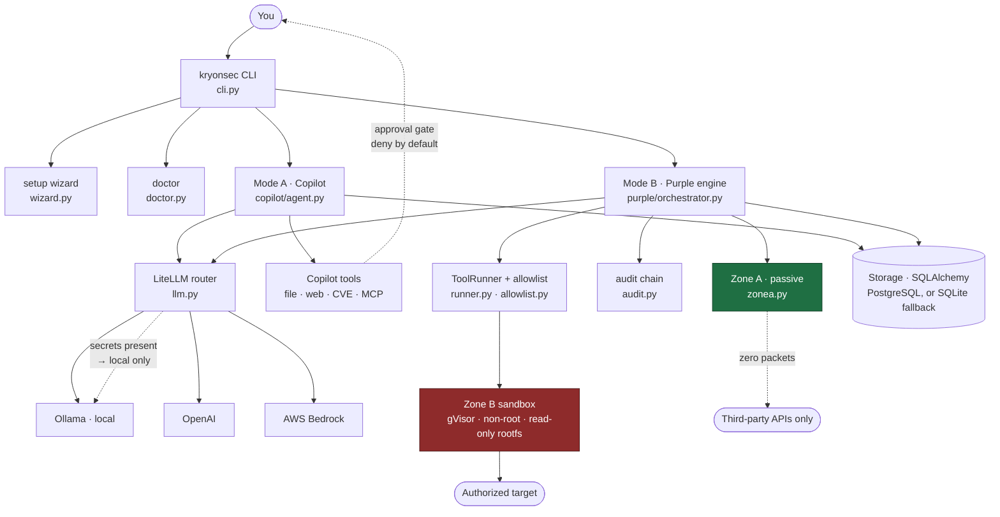
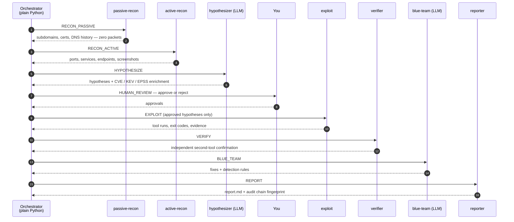
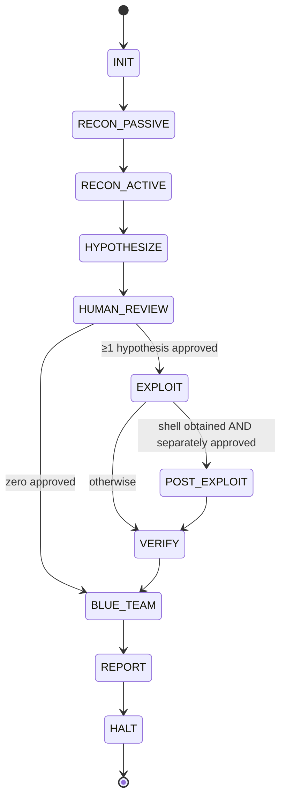
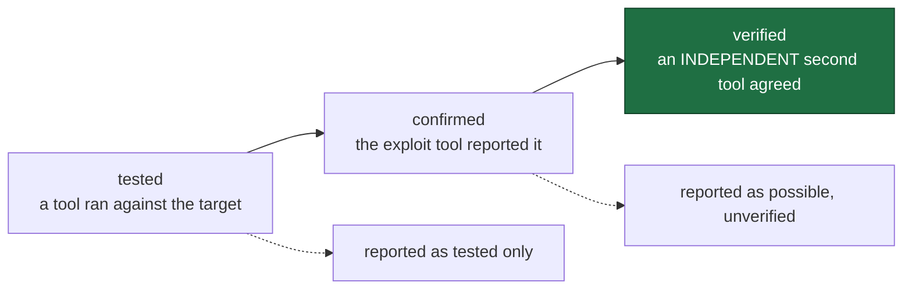
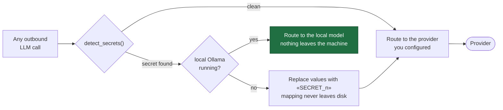

<div align="center">


# Kryonsec

**Everyone is building now. Who's securing it?**

A single-user CLI security platform with two modes: an AI copilot you can talk to,
and a deterministic purple-team engine that finds, tests and proves.

[](https://www.python.org/)
[](CHANGELOG.md)
[](#development)
[-lightgrey)](#requirements)

[Install](#install) · [Copilot mode](#mode-a--general-copilot) · [Purple Team mode](#mode-b--purple-team) · [AWS Bedrock](#aws-bedrock) · [Safety design](#safety-design) · [Repository structure](#repository-structure)

<a href="https://youtu.be/zNEJTBBoiYM">
  
</a>

### ▶️ [Watch the demo](https://youtu.be/zNEJTBBoiYM)

</div>

---

## Table of contents

**The story**

1. [Everyone is building. Who's securing it?](#everyone-is-building-whos-securing-it)
2. [Why I built it](#why-i-built-it)
3. [The rule that shaped everything](#the-rule-that-shaped-everything)

**How it works**

4. [What Kryonsec is](#what-kryonsec-is)
5. [Architecture](#architecture)
6. [The agents](#the-agents)
7. [The 10-state loop](#the-10-state-loop)
8. [The evidence ladder](#the-evidence-ladder)
9. [AWS Bedrock](#aws-bedrock)

**Using it**

10. [Requirements](#requirements)
11. [Install](#install)
12. [Mode A — General Copilot](#mode-a--general-copilot)
13. [Mode B — Purple Team](#mode-b--purple-team)
14. [Configuration reference](#configuration-reference)
15. [Storage schema](#storage-schema)

**The honest parts**

16. [What broke along the way](#what-broke-along-the-way)
17. [What I learned](#what-i-learned)
18. [Current status](#current-status)
19. [What I want to build next](#what-i-want-to-build-next)

**Reference**

20. [Safety design](#safety-design)
21. [Technology stack](#technology-stack)
22. [Repository structure](#repository-structure)
23. [Development](#development)

---

## Everyone is building. Who's securing it?

I'm a cybersecurity researcher. I do bug bounties, I vibe-code a lot, and I love hackathons.

One day I was reading about a startup that got hit really badly because of security
vulnerabilities in their product. And I started thinking.

Everyone is building software now. But not everyone has a security team.

A solo developer isn't hiring a red team. A small startup doesn't have the budget for
security researchers. And AI just made building things dramatically easier — so we're
creating faster than ever, while security still feels like something you bring in *later*.

That didn't make sense to me.

So I thought: why don't I try to build the security team instead?

That's how Kryonsec started. It's my attempt to make security more accessible to
developers, startups and builders who can't just hire a whole team. I wanted something
that looks at a product the way a security researcher would — find things, investigate
them, and help figure out what *actually* matters.

---

## Why I built it

There's a version of this that's just:

```
AI + security tools = done
```

I didn't want to build that. I've tested enough AI systems to know they can be really
smart and still make really stupid mistakes.

So I did not want to hand an LLM unlimited access to a target and say *"bro, go hack
this."* 💀

Two decisions came out of that, and they shaped the whole project:

**1. Human approval sits in the workflow.** When Kryonsec finds a possible attack, it
stops and asks me before doing anything risky. That part matters a lot to me. In
cybersecurity, one wrong decision can become a very expensive problem.

**2. It follows how I actually work.** I've done a lot of bug bounty work, so I have my
own habits around recon — connecting clues, following a thread, figuring out where to go
next. Kryonsec is me trying to turn some of those habits into something repeatable. Not
just "call a tool and print the output," but a real workflow behind it.

That workflow is the part I'm most proud of.

> A good chunk of this got built during **First Commit**, which is also where AWS Bedrock
> made me suffer. 😭 More on that [below](#what-broke-along-the-way).

Kryonsec is live at **[kryonsec.in](https://kryonsec.in)**.

---

## The rule that shaped everything

> ### The LLM is creative, so the system around it must be rigid.

I trust the model to *think*. I don't trust it to *decide what happens next*.

Everything in this project follows from that one sentence:

- **No LLM-driven state transitions.** The orchestrator is plain Python. The model
  proposes; the loop decides.
- **Tool calls are argv lists, never shell strings.** There is no `shell=True` anywhere
  in the tool path.
- **Allowlists, not blocklists.** A tool is rejected unless it matches a per-tool
  template exactly.
- **Secrets never leave the machine by default.** Redacted or routed locally, before any
  third-party call.

The LLM is allowed to be creative in exactly two places: proposing hypotheses, and writing
remediation advice. Everywhere else, the answer is a lookup table.

---

## What Kryonsec is

A **dual-mode CLI for one operator** — you. Not a framework, not a multi-user SaaS. It's
a tool you install on your machine, talk to in a terminal, and — *when you have written
authorization* — point at a target.

The two modes are built on deliberately opposite philosophies:

| | **Mode A — General Copilot** | **Mode B — Purple Team** |
|---|---|---|
| What it is | A conversational security assistant with real tools (LLM function-calling) | A penetration-testing engine with a fixed 10-state loop |
| Who decides | The LLM decides *when* to call tools | **Plain Python** decides every state transition — the LLM only proposes |
| What it touches | Your files, the web, CVE databases, MCP servers | An authorized target, through a gVisor sandbox |
| Where it runs | Linux, WSL, macOS, Windows | **Linux/WSL2 only** — Docker + gVisor required, enforced by `kryonsec doctor` |
| Data visibility | Sanitized post-REPORT engagement summaries only — never raw evidence | Full engagement graph, evidence, and audit chain |

> **Design-of-record:** [`kryonsec-v2.1.1-dual-mode-architecture.md`](kryonsec-v2.1.1-dual-mode-architecture.md)
> is the authoritative spec. v2.1.0 and the fixes draft are kept in the repo for history.

---

## Architecture



**The short version:** the CLI is a thin shell over two engines. Both talk to LLMs through
one router that enforces the secrets gate. Only Mode B is allowed to touch a target, and
only through the sandbox, only with an allowlisted argv, and only with every spawn written
to a hash-chained audit log.

---

## The agents

Ten states, each with one job. **None of them choose what runs next** — they return a
`SubagentResult` and the orchestrator looks up the transition.

| # | State | Agent | Receives | Produces | Zone |
|---|---|---|---|---|---|
| 1 | `INIT` | init | config, target, engagement id | validated scope, budget tracker | — |
| 2 | `RECON_PASSIVE` | passive-recon | target domain | subdomains, cert history, DNS history, cloud assets | A + B (passive) |
| 3 | `RECON_ACTIVE` | active-recon | subdomains from state 2 | ports, services, endpoints, screenshots | **B** sandbox |
| 4 | `HYPOTHESIZE` | hypothesizer **(LLM)** | the engagement graph | candidate hypotheses + CVE/KEV/EPSS enrichment | A + B |
| 5 | `HUMAN_REVIEW` | **you** | hypotheses with confidence | approvals / rejections | — |
| 6 | `EXPLOIT` | exploit | **approved hypotheses only** | tool runs, exit codes, evidence | **B** sandbox |
| 7 | `POST_EXPLOIT` | post-exploit | a shell + separate approval | collected evidence | **B** sandbox |
| 8 | `VERIFY` | verifier | findings from state 6 | independent confirmation | **B** sandbox |
| 9 | `BLUE_TEAM` | blue-team **(LLM)** | findings + scanner output | fixes, detection rules | B scanners + LLM |
| 10 | `REPORT` | reporter | everything above | `report.md` + audit fingerprint | — |

Only **two** of the ten states call an LLM: the hypothesizer and the blue-team. The other
eight are deterministic code. That ratio is the point.

### How the agents hand off



Every arrow in that diagram is a **fixed transition**. The LLM never draws one.

---

## The 10-state loop



The whole transition table, verbatim from `purple/orchestrator.py`:

| From | To | Condition |
|---|---|---|
| `INIT` | `RECON_PASSIVE` | always |
| `RECON_PASSIVE` | `RECON_ACTIVE` | always |
| `RECON_ACTIVE` | `HYPOTHESIZE` | always |
| `HYPOTHESIZE` | `HUMAN_REVIEW` | always |
| `HUMAN_REVIEW` | `EXPLOIT` | `approved_count > 0` |
| `HUMAN_REVIEW` | `BLUE_TEAM` | zero approved |
| `EXPLOIT` | `POST_EXPLOIT` | `shell_obtained and post_exploit_approved` |
| `EXPLOIT` | `VERIFY` | otherwise |
| `POST_EXPLOIT` | `VERIFY` | always |
| `VERIFY` | `BLUE_TEAM` | always |
| `BLUE_TEAM` | `REPORT` | always |
| `REPORT` | `HALT` | always |
| any | `HALT` | `result.status == "halted"` |

Two details worth calling out:

- **Rejection is not a dead end.** If you reject every hypothesis, the engagement still
  routes through `BLUE_TEAM` — you get defensive recommendations anyway. It never jumps
  straight to `REPORT`. That was a real fix (v2.1.1).
- **The budget guard halts the loop** when tokens, wall-clock, or cost run out. Defaults:
  100,000 tokens, 3,600 seconds, $5.00. The same guard refuses to leave `INIT` when the
  Purple Team prerequisites (Linux + Docker + gVisor) are missing.

---

## The evidence ladder

Findings are never just *"the scanner said so."* Every finding climbs three rungs:



| Rung | Meaning |
|---|---|
| **tested** | a tool ran against the target |
| **confirmed** | the exploit tool reported the finding |
| **verified** | an **independent second tool** (e.g. curl boolean probes) agreed |

Only **verified** findings are reported as verified. The report includes repeatable test
steps in plain words, so you can re-check every finding by hand. This is the part that
makes it feel like a researcher's workflow rather than a scanner dump.

---

## AWS Bedrock

This was the hardest thing to get working, so it gets its own section. 😭

Kryonsec supports **three providers** — Ollama (local, preferred), OpenAI, and AWS
Bedrock. Bedrock is not bolted on as an afterthought; it goes through the same secrets
gate as everything else, which means **your secrets are never sent to Bedrock either**,
because Bedrock is a third party like any other.

```toml
[llm]
provider = "bedrock"
bedrock_api_key = "ABSK..."                              # or AWS_BEARER_TOKEN_BEDROCK
bedrock_region = "us-east-1"                             # detected by the wizard
chat_model = "bedrock/us.anthropic.claude-sonnet-4-5-20250929-v1:0"
```

Three things make this trickier than it looks, and each one is handled:

**1. A Bedrock API key has no region.** It's a bearer token — there's no region baked into
it, and the SigV4 access-key/secret-key/instance-profile route isn't used at all. So the
wizard **probes the AWS regions with your key** and remembers the one that accepts it.
That probe doubles as the key check.

**2. Model IDs stay in Bedrock form everywhere.** A model id carries a `bedrock/` prefix —
`bedrock/us.anthropic.claude-sonnet-4-5-20250929-v1:0` — and that's the form you see in
config, in the wizard, and in logs. At the moment of the call, Kryonsec translates it into
an OpenAI-compatible request against
`https://bedrock-runtime.<region>.amazonaws.com/openai/v1`, authenticated with your key as
a bearer token.

**3. Listing a model doesn't mean it answers.** Bedrock's OpenAI-compatible endpoint serves
a *subset* of the catalog. So a model that shows up in `kryonsec setup` can still refuse a
call. The wizard therefore **checks that the model actually answers before it saves the
config** — and it puts cross-region inference profiles first, because newer Claude models
only work through those.

The key is never logged and never placed in an error message.

> Bedrock fighting me for an entire hackathon is genuinely where I learned the most,
> because I wasn't reading about it — I was trying to make it work inside something real.

---

## Requirements

| Component | Copilot (Mode A) | Purple Team (Mode B) |
|---|---|---|
| Python 3.11+ | ✅ | ✅ |
| Linux / WSL2 | optional | ✅ required (gVisor) |
| Docker | — | ✅ required |
| [gVisor](https://github.com/google/gvisor) `runsc` runtime | — | ✅ required |
| Pinned `kryonsec/sandbox` image | — | ✅ required (pulled by installer) |
| Ollama (local LLM) | optional (recommended) | optional (recommended) |
| OpenAI API key | optional | optional |
| AWS Bedrock API key | optional | optional |
| PostgreSQL | optional (SQLite fallback) | optional (SQLite fallback) |

`kryonsec doctor` checks all of this and refuses to start Purple Team if anything is missing.
On apt-based Linux (Ubuntu/Debian/Kali) with sudo, the one-line installer sets up Docker and
gVisor for you, and fetches the sandbox image from a registry (a fast `docker pull`) rather
than building it.

---

## Install

### One command (WSL / Linux / macOS)

```bash
curl -fsSL https://raw.githubusercontent.com/GonchiJoshnaVardhanReddy/kryonsec/main/install.sh | bash
```

The installer:

1. Installs missing prerequisites (`git`, `curl`) on apt systems
2. Checks for Python 3.11+ (tries `python3.13`, `python3.12`, `python3.11`, then a bare
   `python3` — and warns if the only one present is a very new 3.14, where pip may have to
   compile dependencies from source and the install looks stalled)
3. Creates a dedicated virtualenv at `~/.kryonsec/venv`
4. Installs kryonsec into it from GitHub — the newest release tag if the repo has tags,
   otherwise `main`. `KRYONSEC_VERSION=@main` or `@<sha>` overrides both.
5. Adds `~/.kryonsec/venv/bin` to your `PATH` (in `.bashrc`, idempotent)
6. **On Linux (apt + sudo): auto-installs Docker and gVisor (`runsc`) if missing.** On WSL2
   with **Docker Desktop** it also installs a Docker daemon *inside* the distro and moves the
   CLI onto it, because Docker Desktop's daemon runs outside the distro and can never be
   given a gVisor runtime.
7. **Fetches the Zone B sandbox image** when Docker is available — a `docker pull` from
   `ghcr.io` in the normal case, which is minutes instead of tens of minutes. If the registry
   is unreachable, the image for this version isn't published yet, or you're offline, it
   falls back to building locally with live progress (2+ GB, 30+ min on slow links). Either
   way it's tagged `kryonsec/sandbox:latest`, which is what `doctor` and the runner look for.
8. Runs `kryonsec setup` — the first-run wizard
9. Runs `kryonsec doctor` so the final state is visible

To skip the sandbox image entirely and do it later:

```bash
curl -fsSL https://raw.githubusercontent.com/GonchiJoshnaVardhanReddy/kryonsec/main/install.sh | KRYONSEC_SKIP_SANDBOX=1 bash
# later — pull (fast):
docker pull ghcr.io/gonchijoshnavardhanreddy/kryonsec-sandbox:latest
docker tag ghcr.io/gonchijoshnavardhanreddy/kryonsec-sandbox:latest kryonsec/sandbox:latest
# or build (slow):
git clone https://github.com/GonchiJoshnaVardhanReddy/kryonsec.git
cd kryonsec
docker build --progress=plain -t kryonsec/sandbox -f containers/sandbox/Dockerfile.kali .
```

Sandbox-image environment variables:

| Variable | Effect |
|---|---|
| `KRYONSEC_SANDBOX_IMAGE` | Override the image ref the installer pulls; may carry a `@sha256:<digest>` |
| `KRYONSEC_REGISTRY_TOKEN` | GHCR token — only needed if the repo/image is private (`read:packages`) |
| `KRYONSEC_REGISTRY_USER` | Username for that token (default `kryonsec`) |
| `KRYONSEC_SKIP_SANDBOX=1` | Skip the image fetch/build entirely |

If a build fails partway, already-downloaded layers are cached — re-running resumes where it stopped.

### Windows (PowerShell)

```powershell
irm https://raw.githubusercontent.com/GonchiJoshnaVardhanReddy/kryonsec/main/install.ps1 -OutFile install.ps1
powershell -ExecutionPolicy Bypass -File .\install.ps1
```

Download it first, read it if you like, then run it. `-ExecutionPolicy Bypass` applies to
that one process only — a freshly downloaded script is blocked outright under the Windows
client default policy.

Windows gets Copilot mode only. Purple Team is gated behind a runtime check and must never
run on the Windows host. Use WSL2 for Mode B.

### From source (development)

```bash
git clone https://github.com/GonchiJoshnaVardhanReddy/kryonsec.git
cd kryonsec
pip install -e ".[dev]"
kryonsec setup
```

---

## First-run setup wizard

The first launch without a config starts the wizard automatically (re-run anytime with
`kryonsec setup`). It walks you through:

1. **Pick your LLM provider** — OpenAI, Ollama (local), or AWS Bedrock
2. **Provider setup**
   - *OpenAI:* paste your API key → tested live → pick a model from the list (most recent first)
   - *Ollama:* pick from your already-pulled local models
   - *AWS Bedrock:* paste a Bedrock API key (starts with `ABSK`) → the wizard prints how to
     create one, **auto-detects your region**, then lists models with cross-region inference
     profiles first — and verifies the model actually answers before saving
3. **Pick the built-in agent tools** (space to select, enter to continue)
4. **Pick MCP servers** — presets or add your own (see [MCP integration](#mcp-integration))
5. **A summary screen** of everything you chose

The wizard writes `~/.kryonsec/config.toml` with **owner-only permissions** — that file holds
your API key. Environment variables still override the file for power users and CI.

---

## Mode A — General Copilot

```bash
kryonsec                  # start the chat
kryonsec doctor           # preflight checks
kryonsec setup            # re-run the wizard
```

### The agent

The copilot is a real tool-using agent (LLM function-calling), not a chat wrapper. It decides
when to call tools, up to 8 tool rounds per answer, then must produce text. You see every tool
call as it happens:

```
[COPILOT]> is CVE-2024-3094 relevant to my nginx setup?
  └─ cve_lookup(cve_id=CVE-2024-3094)
  └─ file_read(path=/etc/nginx/nginx.conf)
Yes — here's what matters for your config...
```

Built-in tools the agent can call (only the ones you enabled in setup):

| Tool | What it does |
|---|---|
| `file_read` | read a file — **approval-gated** outside `~/kryonsec/workspace` |
| `file_write` | write a file — **approval-gated** outside the workspace |
| `list_dir` | list a directory — **approval-gated** outside the workspace |
| `web_search` | keyless multi-engine web search, results enter chat context |
| `cve_lookup` | NVD CVE lookup, cached locally for offline reuse |

Every file action outside the workspace shows a yellow approval panel — why the agent wants
the file, and Approve/Deny. **Deny is the default (Enter = Deny).**

### Slash commands

| Command | What it does |
|---|---|
| `/cve CVE-2024-1234` | CVE lookup from NVD, cached offline |
| `/search <query>` | web search — results go into context |
| `/read <path>` | read a file (approval-gated outside workspace) |
| `/ls <path>` | list a directory (approval-gated outside workspace) |
| `/write <path>` | write text to a file in the workspace |
| `/workspace` | show the workspace path |
| `/mode` | switch copilot ⇄ purple mode — or press **Shift+Tab** |
| `/help` | command reference |
| `/quit` (`exit`, `quit`, `q`) | leave — session is persisted |

### Memory

- **Session STM:** messages are kept and compacted when they exceed 80% of the token budget.
  Compaction runs with secrets redacted, and a broken compaction model skips itself rather
  than killing your chat mid-turn.
- **Long-term memory:** after each exchange, a background pass extracts durable facts about you
  (role, preferences, ongoing projects) into `general_user_ltm` — best-effort by design; memory
  failure never breaks the chat.
- **Long-term memory is isolated:** the copilot can see *sanitized post-REPORT engagement
  summaries* only. It never sees raw evidence, credentials, or live engagement data.

### Web search

`/search` (and the agent's `web_search` tool) tries five keyless sources in order —
DuckDuckGo html/lite/API, Mojeek, Wikipedia — so it keeps working when one engine
bot-challenges your network. Results are cached for a day.

### MCP integration

Copilot is an MCP client. During setup you can enable servers (stdio transport, one subprocess
per server, connected once per session — not per message):

| Preset | Command | Notes |
|---|---|---|
| `fetch` | `uvx mcp-server-fetch` | fetch web pages as clean text, no API key |
| `filesystem` | `npx -y @modelcontextprotocol/server-filesystem` | needs Node; wizard asks for the allowed directory |

`uvx` comes with [uv](https://docs.astral.sh/uv/) and `npx` with [Node.js](https://nodejs.org/).
The installers put uv into kryonsec's own venv so the `fetch` preset works on a fresh machine;
Node is not installed for you — setup warns if it is missing, and names what to install.

You can also add any custom stdio MCP server (name + command + env). Every MCP tool the server
exposes becomes a tool the agent can call.

---

## Mode B — Purple Team

One command runs a full engagement:

```bash
kryonsec purple --target your-authorized-target.com
# or: kryonsec purple --target example.com --id my-engagement
# with blue-team code scanning (folder mounted read-only into the sandbox):
kryonsec purple --target example.com --code /path/to/source
```

Or switch inside the chat with `/mode` (or **Shift+Tab**), then type a domain.

> ⚠️ **Only run this against systems you are authorized to test.**

### The operations console

Purple Team used to print raw developer logs — a spinner over a one-line inventory of every
tool in the state, full tracebacks from public APIs answering 429/403/404, and a final summary
in plain text. It's now a single live console (v1.3.2).

The console learns everything from two streams that already existed — the orchestrator's state
callback and the audit chain, via a read-only `add_observer` — so **no subagent knows a UI
exists**. What you get:

- **Honest progress.** The old `20%` was the fraction of *states entered*, which reads as work
  completed. It now says `Stage 3 of 10`.
- **Tool activity as it happens.** Every tool shows its operator-facing name (`crt.sh`, not
  `crt_sh_subdomains`), what it does, how long it took, and its result. Completed tools stay as
  history; only tools that actually ran appear.
- **Tracebacks are split, not shown.** One line per warning on the console; the full record,
  `exc_info` intact, goes to `engagements/<id>/debug.log`.
- **Human review is a proper panel** (`A`/`R`) instead of a bare `y/N` prompt.
- **Piped and CI runs stay observable** — with no TTY it prints one line per state.

### The audit chain

Every step is appended to a **tamper-evident audit log**: append-only JSONL, SHA256-chained
records, hashes computed over canonical JSON (sorted keys, tight separators) — the same
serialization written to disk, so verification replays byte-identically. The chain head hash is
printed at the end of every engagement and can be anchored periodically (WORM object + stdout).

### Zones

- **Zone A (host):** passive recon and enrichment run host-side using only third-party APIs
  (crt.sh certificates + issuer/validity, Wayback Machine archives, OTX passive DNS, RIPEstat
  whois/ASN, NVD, CISA KEV, EPSS, OSV, GitHub Advisory, Shodan and Censys with keys, RDAP WHOIS
  via the IANA bootstrap, GitHub recon with an optional token, HackerTarget DNS history).
  **Zero packets to the target.** API keys are injected per-call and never logged.
- **Zone B (sandbox):** all active tool execution happens inside a Kali-based Docker container
  under the **gVisor `runsc` runtime**, with a seccomp profile, a **non-root** user, and a
  read-only root filesystem. With `--code`, your source folder is mounted **read-only** at a
  fixed `/code` path for the static analyzers. Screenshots (gowitness) go to a read-write
  `/evidence` mount — the only one — landing under `~/.kryonsec/engagements/<id>/evidence/`.

### Enrichment and the report

Hypotheses that name a CVE get public-risk context automatically: NVD score/CPE/CWE, CISA KEV
(actively-exploited list), EPSS (probability of exploitation), OSV and GitHub Advisory severity
+ affected packages, whether public exploit code exists (searchsploit in the sandbox), and
matching nuclei templates.

The report shows all of it, plus a CVSS 3.1 base score calculated locally from each hypothesis's
vector, a timeline built from the audit chain, deduplicated findings, and normalized evidence —
with a tamper-evident fingerprint of the audit chain. With `--code`, it also has a "Code scanning
results" section with an SBOM summary (syft) and one row per scanner.

### End of engagement

The summary screen gives you a one-line verdict first (halted / verified findings /
possible-but-unverified / nothing confirmed), then the evidence: subdomains found, hypotheses
with confidence scores, tool runs with exit codes, findings with their verified status, the
audit chain head, and the report path (`~/.kryonsec/engagements/<id>/report.md`).

If the sandbox isn't available, the engagement still runs — it stops after passive recon,
because Zone A works everywhere.

---

## Safety design

The safety layers:

| # | Layer |
|---|---|
| 1 | **No LLM-driven state transitions** — orchestrator is plain Python with a lookup table |
| 2 | **Allowlists, not blocklists** — ToolRunner validates every argv against a per-tool template |
| 3 | **argv lists, never shell strings** — no `shell=True` anywhere in the tool path |
| 4 | **Secrets never leave the machine by default** — see the [data flow](#the-secrets-gate) below |
| 5 | **RECON_PASSIVE sends zero packets** — host-side Zone A only |
| 6 | **No docker.sock in the kryonsec container** — Docker access via a socket proxy with endpoint allowlisting |
| 7 | **Audit chain** — append-only JSONL, SHA256-linked, canonical-JSON hashed |
| 8 | **Purple Team is Linux-only** — `doctor` checks Docker + `runsc` + pinned image and refuses otherwise |
| 9 | **Mode isolation** — general mode reads only sanitized post-REPORT summaries |

Plus, in Copilot mode: every file action outside the workspace requires explicit approval
(deny by default), and tool output is size-bounded (`max_tool_output_chars`).

### The secrets gate

This is the flow every outbound LLM call goes through:



- **The gate re-runs before *every* LLM round**, not once per session — because a tool result
  can introduce a secret mid-conversation.
- **Compaction is stricter.** With secrets present, compaction is local-only and refuses
  outright (`CompactionMustStayLocal`) rather than using a hosted model.
- **Password and key labels survive redaction** — `password: «SECRET_1»` stays readable, so
  summaries still make sense.
- **Engagement data, credentials, and raw evidence are never sent to third-party LLMs.**

---

## Configuration reference

Config lives at `~/.kryonsec/config.toml` (override the directory with `KRYONSEC_HOME`).
Written by the wizard; hand-editable.

```toml
[llm]
provider = "bedrock"                              # "openai" | "ollama" | "bedrock"
chat_model = "bedrock/us.anthropic.claude-sonnet-4-5-20250929-v1:0"
search_model = "gpt-4o-mini"                      # fact-extraction / light calls
compaction_model = "gpt-4o-mini"                  # chat compaction (local when secrets)
local_model = "ollama/llama3.1"                   # fallback + secrets-present routing
openai_api_key = "sk-..."
ollama_host = "http://localhost:11434"
bedrock_api_key = "ABSK..."                       # also AWS_BEARER_TOKEN_BEDROCK
bedrock_region = "us-east-1"                      # detected by the wizard

[session]
max_session_tokens = 16000
compaction_trigger_ratio = 0.8
compaction_keep_tokens = 8000
max_messages = 50

[limits]
max_tool_output_chars = 20000

[sandbox]
image = "kryonsec/sandbox:latest"                 # or kryonsec/sandbox@sha256:<digest>

[tools]
enabled = ["file_read", "file_write", "web_search", "cve_lookup"]

[[mcp.servers]]
name = "fetch"
command = "uvx mcp-server-fetch"
env = "{}"
```

Environment variables (they win over TOML): `OPENAI_API_KEY`, `AWS_BEARER_TOKEN_BEDROCK`,
`AWS_REGION_NAME`, `DATABASE_URL`, `OLLAMA_HOST`, `KRYONSEC_HOME`, `KRYONSEC_WORKSPACE`,
`KRYONSEC_SANDBOX_IMAGE`, `KRYONSEC_VERSION` (installer).

### LLM backends

All LLM calls route through **LiteLLM** (`litellm.completion`) with a provider choice that is
**exclusive** — an Ollama config never calls a hosted API, and an OpenAI or Bedrock config never
silently falls back to a different provider. The only exception is the local model, and only
for the secrets gate.

1. **Ollama (local, preferred):** `ollama serve` + `ollama pull llama3.1` — nothing leaves your machine
2. **OpenAI:** API key from the wizard or `OPENAI_API_KEY` — never used for compaction when secrets are present
3. **AWS Bedrock:** see [the Bedrock section](#aws-bedrock) above

---

## Storage schema

SQLAlchemy models (`src/kryonsec/storage/models.py`). PostgreSQL via `DATABASE_URL` is the system
of record; without it, Kryonsec falls back to an embedded SQLite DB (`~/.kryonsec/kryonsec.db`)
for Copilot-mode memory.

| Table | Mode | Purpose |
|---|---|---|
| `general_sessions` | A | persisted chat sessions |
| `general_user_ltm` | A | long-term facts + preferences about the user |
| `system_knowledge` | A | system-level knowledge |
| `stm_nodes` | B | engagement graph nodes (subdomains, hypotheses, attempts, findings) |
| `ltm_target_profiles` | B | per-target knowledge across engagements |
| `ltm_engagement_summaries` | B | sanitized summaries — the only engagement data Mode A can read |
| `engagement_secret_map` | B | `«SECRET_n»` → secret mappings for an engagement |
| `checkpoints` | B | engagement checkpoints |

---

## What broke along the way

I want to be honest about this part, because it's most of what actually happened.

### AWS Bedrock made me suffer 😭

Sometimes the model worked. Sometimes it didn't. Then the gateway had problems. Then region
issues. Then I'd fix one thing and discover another. At some point I was just looking at my
terminal thinking *"bro… wtf."*

The reason it was hard is that it's genuinely three problems stacked: a key with no region, a
model-id format that has to survive everywhere, and an OpenAI-compatible endpoint that serves
only a subset of the catalog. Byte-for-byte, the fix was to probe regions to detect one, keep
the `bedrock/` id form everywhere and translate only at call time, and **verify the model answers
before saving the config** — so you never end up with a config that lists a model that refuses
to run.

Honestly, it was my favourite part, because I wasn't reading about Bedrock. I was making it work.

### Docker and gVisor fought back

Getting the whole security tooling environment working together was pain. The installer alone
took several rounds:

- The gVisor apt source had to be repaired, and it kept **breaking Docker** in the process
- The installer was fetching a **runsc package the bucket doesn't actually publish**
- An apt-source purge in the installer could **kill the installer itself**

### The code review that found 10 real bugs

I had a review done of v1.1.1 and it came back with ten findings plus a bonus bug. Two of them
were genuinely scary:

- **Secrets leaked to hosted LLMs.** The secrets gate ran once, *before* the tool loop. If a
  tool result (say, `file_read` on `.env`) introduced a secret in round 1, round 2 sent it
  straight to the provider. The gate now re-runs before **every** round.
- **Token and cost budgets were never enforced.** `record_usage()` existed with *zero call
  sites*, so `used_tokens` and `used_cost_usd` stayed 0 forever and the guard could only ever
  trip on wall-clock time. A budget guard that never fires is decoration.

There were smaller ones that still mattered: the report's redaction used its own private pattern
list that had **drifted** from the shared detector and was missing AWS keys and GitHub tokens —
in the one artifact meant to be shared. And the MCP connection's `ready` flag was initialized to
`None` and never became a `threading.Event`, so every *real* MCP connect crashed into the
"failed to start" path. That one only surfaced while fixing something else.

### A verification bug that made real findings look fake

The VERIFY baseline stripped the entire query string. So the baseline fetch dropped `?id=1` and
fetched a *different page* — a missing-parameter error — which meant `true_out == base_out` could
almost never hold. Genuine boolean-SQLi findings were systematically "failing" verification.

That's the worst kind of bug in a security tool: not a crash, just quiet wrongness that makes you
distrust your own results.

### Install took 30 minutes and looked broken

Every fresh install downloaded ~50 pinned tools (~2 GB) inside a Docker build. On a slow link
that's 30+ minutes and looks like it's hung even with progress output.

The fix was to publish the image to GHCR and pull it instead of building. But the *real* bug
turned out to be smaller and dumber: `install.sh` asked for `:vX.Y.Z`, tried exactly **once**,
and dropped to the 30-minute build whenever that tag had never been published. It now tries the
version tag, then `:latest`, and only builds if both fail. Back-filling tags was never the fix.

### I tested the wrong version

I fixed bugs in the new version and was still running an older one. So:

```
I fixed the bug.
Then tested the wrong thing.
Then wondered why the bug was still there.
```

💀

### A scanner graded my repo F

After all that, an automated security scanner looked at the repo and gave it **0/100, grade F**,
with 11 "critical findings."

Every single one was a false positive. Ten were **test fixtures** in `tests/` — strings that only
exist to prove the secret detector fires, including AWS's own documentation sample key. The
eleventh was a **comment** in `install.ps1` showing users how to run the installer.

So I did two things: rebuilt the fixtures from parts so nothing in the source matches a
credential pattern while the detector still sees the full value, and switched the documented
Windows install to download-then-run. The lesson there wasn't "the scanner is dumb" — it was that
a public repo gets read by tools that can't tell a fixture from a live key.

---

## What I learned

**Rigid orchestration beats a smart prompt.** The single best decision in this project was
refusing to let the LLM choose state transitions. The model proposes hypotheses; a lookup table
decides everything else. When something goes wrong now, I can point at a line of Python instead
of an argument with a language model.

**A safety layer you don't test isn't a safety layer.** The secrets gate *looked* correct. It
passed review by eye. It still leaked, because it ran once per session instead of once per round.
The tests are what found that — one test per safety layer, no exceptions.

**Budgets that never fire are decoration.** `record_usage()` with zero call sites is worse than
no budget at all, because you *believe* you're protected.

**Allowlists beat blocklists, every time.** There's no list of "bad" nmap flags to maintain,
because nmap can only ever be `-Pn -sT -sV -sC --max-rate {rate} -p {ports} {target}`. Adding a
tool means writing its template, and that forces you to think about what that tool should be able
to do before it ever runs.

**Design for the API you wish you had.** Bedrock's OpenAI-compatible endpoint serving a subset of
the catalog isn't something the docs lead with. Verifying the model answers *before* saving config
turned a category of confusing failures into a wizard step.

**The install experience is the product.** People judge a security tool by whether it installs.
Thirty minutes of silence reads as "broken" no matter how good the engine is.

---

## Current status

| Component | State |
|---|---|
| v2.1.1 spec | ✅ done |
| Storage layer (SQLAlchemy) | ✅ done |
| Installer + setup wizard | ✅ done |
| Config file (`~/.kryonsec/config.toml`) | ✅ done |
| Copilot agent loop (LLM function-calling) | ✅ done |
| Built-in agent tools (read/list/write, web search, CVE) | ✅ done |
| MCP server integration | ✅ done |
| Long-term memory (fact recall + extraction) | ✅ done |
| TUI (Shift+Tab mode toggle, history) | ✅ done — live-verified |
| Purple Team state machine (all 10 states) | ✅ done — live-verified on WSL2 |
| Audit chain | ✅ done |
| Tool allowlist + Kali sandbox (Docker/gVisor) | ✅ done — live-verified |
| Tool expansion (~50 tools, 8 phases) | ✅ done — see [`docs/TOOL-EXPANSION-2026-09-13.md`](docs/TOOL-EXPANSION-2026-09-13.md) |
| Passive recon sources (10 Zone A sources) | ✅ done |
| Hypothesis enrichment (NVD/CPE/CWE, KEV, EPSS, OSV, GHSA, searchsploit, nuclei) | ✅ done |
| Blue-team code scanners (`--code`, read-only mount) | ✅ done |
| Report enrichment (CVSS 3.1 calculator, dedup, evidence normalizer) | ✅ done |
| Evidence ladder (tested → confirmed → verified) | ✅ done — live-verified |
| ⚡ Purple Team operations console (v1.3.2) | ✅ done |
| AWS Bedrock provider (auto region, model verify) | ✅ done |
| Sandbox image published to GHCR (pull, not build) | ✅ done |

**Good to know:**

- **Purple Team needs Linux + Docker + gVisor.** Windows gets Copilot mode only.
- **`--code` is CLI-only** — not reachable from the chat loop.
- **Some scanners fetch their databases over the network.** semgrep `--config=auto`, trivy's vuln
  DB, osv-scanner and grype all want egress for that.

---

## What I want to build next

1. **Target-scope egress proxying for Zone B.**
2. **Interactsh and Burp Community** — both need listening services and callback traffic.
3. **Post-exploitation collection tooling**, so the `POST_EXPLOIT` state has work to do.
4. **Digest-pinned sandbox images by default** once the release process is steady enough that
   pinning doesn't break the local-build path.
5. **`--code` from the chat loop**, so you don't have to leave the conversation to scan a repo.

The bigger idea behind Kryonsec is still really simple to me:

> **If everyone can build software now, everyone should have easier access to security too.**

I don't know exactly how far I'll take it. But somewhere between bug bounties, vibe coding,
broken Docker containers and Bedrock refusing to behave, I ended up building something I actually
want to use.

---

## Technology stack

| Layer | Choice | Why |
|---|---|---|
| Language | **Python 3.11+** | Type hints everywhere; the whole tool ecosystem talks to it |
| Data models | **Pydantic v2** | Structured LLM output and recon data need real validation, not dicts |
| LLM routing | **LiteLLM** | One `completion()` call for Ollama, OpenAI and Bedrock — and one place to enforce the secrets gate |
| Prompts & reports | **Jinja2** | Prompts are templates in `kryonsec/templates/`, reviewable as files |
| Storage | **SQLAlchemy 2.0** + **PostgreSQL** | Postgres is the system of record; SQLite is the embedded Copilot fallback |
| Encryption | **cryptography** | Encrypted secret mappings at rest |
| CLI / TUI | **prompt_toolkit** + **rich** | Shift+Tab mode toggle, history, and the live console |
| MCP | **mcp** SDK | Copilot is a real MCP client, stdio transport |
| Sandbox | **Docker + gVisor (`runsc`)** | A hostile tool in a hostile-target engagement needs a real isolation boundary |
| Sandbox base | **Kali Linux** | The tool inventory in the expansion doc is Kali-shaped |
| Tests | **pytest** | 864 tests across 38 files |

Why gVisor specifically: the sandbox runs tools that are *supposed* to be dangerous, against
targets I don't control. A container alone shares the host kernel. `runsc` puts a user-space
kernel between the tool and the host, which is the difference between "isolated" and
"isolated enough to point at someone else's system."

---

## Repository structure

```
kryonsec/
├── install.sh / install.ps1          # installers (bash + PowerShell)
├── pyproject.toml                    # deps, entry point, Python >=3.11
├── CHANGELOG.md                      # the real version history
├── PLAN.md                           # sandbox image publishing (done)
├── kryonsec-v2.1.1-dual-mode-architecture.md   # design-of-record spec
├── AUDIT-2026-09-08.md               # security audit notes
├── docs/
│   ├── logo.png
│   └── TOOL-EXPANSION-2026-09-13.md  # the ~50-tool expansion, phase by phase
├── containers/sandbox/
│   ├── Dockerfile.kali               # pinned Kali base, SHA256-verified tool
│   │                                 #   install, non-root user
│   ├── entrypoint.sh                 # argv-only tool execution + JSON output
│   └── scripts/
│       ├── find_secrets.py
│       ├── nuclei_meta.py
│       └── openapi_probe.py
├── .github/workflows/
│   └── sandbox-image.yml             # builds + pushes the image on every v* tag
├── src/kryonsec/
│   ├── cli.py                        # entry point: chat loop, purple runner
│   ├── config.py                     # TOML config (read/write, env overrides)
│   ├── doctor.py                     # preflight checks + Mode B gate
│   ├── wizard.py                     # first-run setup wizard
│   ├── tui.py                        # prompt_toolkit input, Shift+Tab toggle
│   ├── status.py                     # spinner / status line
│   ├── llm.py                        # LiteLLM routing + the secrets gate
│   ├── bedrock.py                    # Bedrock region probe + model discovery
│   ├── secrets.py                    # detect / redact («SECRET_n») / restore
│   ├── containers/
│   │   └── kryonsec-seccomp.json     # seccomp profile for Zone B
│   ├── copilot/                      # ---- Mode A ----
│   │   ├── agent.py                  #   tool-calling loop (8-round cap)
│   │   ├── session.py                #   session STM + compaction
│   │   ├── tools.py                  #   file tools + approval gate
│   │   ├── cve.py                    #   NVD lookup with offline cache
│   │   ├── websearch.py              #   5-source keyless search
│   │   └── mcp_tools.py              #   MCP client (stdio, one process/server)
│   ├── purple/                       # ---- Mode B ----
│   │   ├── orchestrator.py           #   10-state loop, budget guard, HALT
│   │   ├── runner.py                 #   engagement runner + state registry
│   │   ├── ui.py                     #   the live operations console
│   │   ├── zonea.py                  #   Zone A passive recon fetcher
│   │   ├── recon_passive.py          #   passive sources (10)
│   │   ├── recon_active.py           #   active recon (sandbox tools)
│   │   ├── hypothesize.py            #   LLM hypothesis proposals
│   │   ├── enrichment.py             #   NVD / KEV / EPSS / OSV / GHSA
│   │   ├── human_review.py           #   blocking approval gate
│   │   ├── exploit.py                #   approved-hypothesis execution
│   │   ├── post_exploit.py           #   shell-based collection
│   │   ├── verify.py                 #   independent verification
│   │   ├── blue_team.py              #   fixes + detection rules
│   │   ├── report.py                 #   Jinja2 report generation
│   │   ├── allowlist.py              #   per-tool argv templates
│   │   ├── audit.py                  #   SHA256-chained JSONL audit log
│   │   ├── sandbox.py                #   Zone B gVisor container driver
│   │   └── runtime_checks.py         #   Docker / runsc / image checks
│   ├── storage/                      # SQLAlchemy models + session layer
│   ├── migrations/                   # schema migrations
│   └── templates/                    # Jinja2: system_prompt, hypothesize,
│                                     #   blue_team, report
└── tests/                            # 38 files, 864 tests
```

---

## Development

```bash
pip install -e ".[dev]"
pytest
```

- **Python 3.11+**, type hints everywhere, **Pydantic v2** for structured data
- LLM calls go through **LiteLLM only** (`litellm.completion`)
- Database access through a thin repository layer (`kryonsec/storage/`)
- Prompts and reports are **Jinja2 templates** in `kryonsec/templates/`
- **Every safety layer has at least one unit test** — 864 tests across 38 files, covering the
  audit chain, allowlist, secrets redaction, orchestrator transitions, compaction, sandbox,
  enrichment, scanners, report validation, the CVSS calculator, TUI, wizard, and more

Optional extras: `pip install -e ".[postgres]"` for the PostgreSQL driver (`psycopg[binary]`, v3).
A plain `postgresql://…` `DATABASE_URL` is pointed at whichever psycopg is installed; write
`postgresql+psycopg2://` yourself if you specifically want psycopg2.

Dev note: since v1.1 config comes from `~/.kryonsec/config.toml` (the old `.env` loading is gone).
Run `kryonsec setup` once, or export `OPENAI_API_KEY` for a quick start.

### Sandbox smoke test (Linux / WSL2)

```bash
kryonsec doctor                    # must pass: docker, runsc, pinned image
kryonsec purple --target example.com --code ~/src/my-app
```

Watch the BLUE_TEAM state — it should report the scanners that ran
(semgrep/bandit/gitleaks/trivy/checkov/syft/osv-scanner/grype, plus hadolint when the folder has
a Dockerfile), and the report's fix list should be grounded in that scanner evidence. After the
first run on a new version, fetch the new sandbox image (new tools are baked in):

```bash
docker pull ghcr.io/gonchijoshnavardhanreddy/kryonsec-sandbox:latest
docker tag ghcr.io/gonchijoshnavardhanreddy/kryonsec-sandbox:latest kryonsec/sandbox:latest
# or, from a source checkout:
docker build -t kryonsec/sandbox -f containers/sandbox/Dockerfile.kali .
```

### Publishing a release (maintainer)

The sandbox image is published to GHCR by `.github/workflows/sandbox-image.yml`, so users pull
instead of building.

1. **One-time repo setup:** Settings → Actions → General → Workflow permissions → *Read and write
   permissions*. The default `GITHUB_TOKEN` cannot push packages without this.
2. **First image:** the workflow can't retro-publish for tags that predate it. Run it once by
   hand: Actions → *sandbox-image* → *Run workflow* on `main`.
3. **Every release:** tag and push (`git tag v1.3.2 && git push --tags`). The workflow builds and
   pushes `:v1.3.2` plus `:latest` (non-prerelease tags only).
4. **Read the digest** off the run's job summary.
5. **Optionally pin it** via `KRYONSEC_SANDBOX_IMAGE` (spec §8.6). Pinning is a deliberate
   per-release choice: the installer retags the pulled image as `kryonsec/sandbox:latest`, so a
   digest-pinned default only works for users who pull that digest. Leaving the tag default keeps
   offline rebuilds working.
6. **Verify** on a clean machine: `docker pull` the new tag, then `kryonsec doctor` must pass.

---

<div align="center">

**Kryonsec is built for authorized security testing only.**
You are responsible for having written permission before pointing Purple Team at any target.

Built by **Gonchi Joshna Vardhan Reddy** · [kryonsec.in](https://kryonsec.in)

</div>
